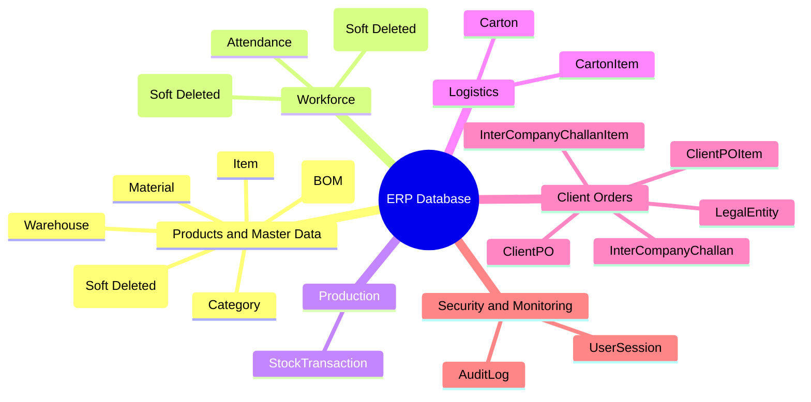
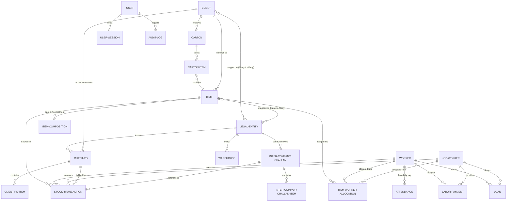
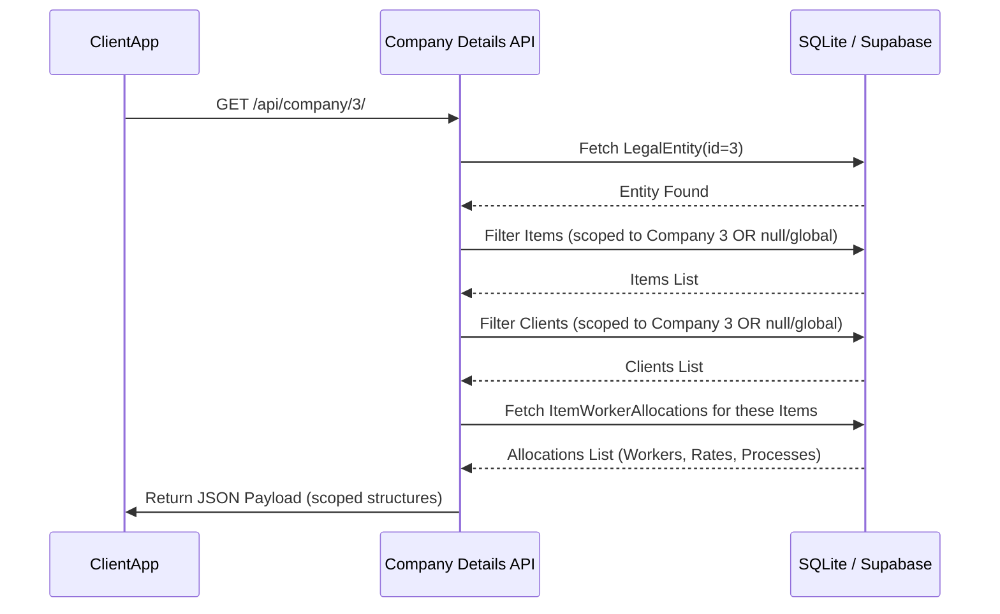

# ERP Database & API Logic Documentation

This document serves as the comprehensive, premium technical reference for the ERP-2026 database design, data flow mechanics, data entry workflows, and core API systems. It details the schema boundaries, relationship topologies, transaction state machines, and business rules governing the operations.

---

## 1. Database Architecture & Schema Topology

The database is built on a modular Django architecture, segregated into logical business sub-domains: **Products & Master**, **Workforce**, **Production**, **Logistics**, **Ledger & Payroll (Finance)**, **Client Orders**, and **Security & Monitoring**.

### 1.1 High-Level Domain Mindmap

This mindmap visualizes the categorization of domain entities in the database.



### 1.2 Entity Relationship Diagram (ERD)

This diagram shows the foreign key connections, cardinalities, and data-flow pathways across domains.



---

## 2. In-Depth Model Catalog

### 2.1 Products & Master Data (`apps/products/models.py`)

#### `Item`
Represents raw parts, semi-finished items, assemblies, or finished goods. Integrates `SoftDeleteModel`.
*   **Fields**:
    *   `code` (CharField, Unique): Unique identifier.
    *   `name` (CharField): Short descriptive name.
    *   `category` (CharField, Default: `"OTHER"`).
    *   `sub_category` (CharField, Nullable).
    *   `material` (CharField, Default: `"OTHER"`).
    *   `variant` (CharField, Nullable).
    *   `item_type` (CharField, Default: `"REGULAR"`).
    *   `casting_weight` (FloatField): Weight of raw casting (kg).
    *   `machining_weight` (FloatField): Weight after machining (kg).
    *   `lot_size` (IntegerField): Default manufacturing batch size.
    *   `lot_with_box` (IntegerField): Quantity packed per outer box.
    *   `process` (CharField, Choice: `ProcessType`): Active process context.
    *   `casting_required` / `machining_required` / `polishing_required` / `packing_required` (BooleanFields): Defines the route sheet.
    *   `rate_per_piece` (FloatField): Global default piece rate.
    *   `companies` (ManyToManyField to `LegalEntity`): Controls organizational visibility (if blank, item is **global**).
    *   `client` (ForeignKey to `Client`): Explicitly binds finished items to target clients.
*   **Properties & Methods**:
    *   `active_allocations`: Returns list of allocations where workers are active (not soft-deleted).
    *   `calculate_cartons_and_loose(quantity)`: Evaluates packaging distribution by splitting a quantity into `(cartons, loose)` based on `lot_with_box` or `lot_size`.

#### `Client`
Customer or purchaser profile record.
*   **Fields**:
    *   `name` (CharField), `phone`, `email`, `city`, `address`, `gst_number` (CharField, 15).
    *   `companies` (ManyToManyField to `LegalEntity`): Binds client access limits (if blank, client is **global**).

#### `ItemComposition`
Defines Bills of Materials (BOM) relationships. Binds a parent `Item` to multiple component `Item`s with quantities.
*   **Fields**:
    *   `parent_item` (ForeignKey to `Item`, related_name: `components`).
    *   `component_item` (ForeignKey to `Item`, related_name: `parent_sets`).
    *   `quantity` (PositiveIntegerField, Default: 1).
*   *Constraint*: `unique_together = ('parent_item', 'component_item')` prevents duplicate definition.

---

### 2.2 Workforce Management (`apps/workforce/models.py`)

#### `Worker`
Internal payroll employee.
*   **Fields**:
    *   `employee_id` (CharField, Unique, Autogenerated format: `EMP-XXXX` starting at `1001`).
    *   `name` (CharField), `phone`, `designation`, `joining_date`, `active`.
    *   `salary_model` (Choices: `DAILY` [Daily Wage], `FIXED` [Monthly Fixed Salary], `HOURLY`).
    *   `daily_rate`, `monthly_fixed_salary`, `monthly_allowance` (FloatFields).
    *   `standard_shift_hours` (FloatField, Default: 8).
    *   `overtime_rate` (FloatField, Autocalculated at `daily_rate / standard_shift_hours` if unset and salary model is `DAILY`).
    *   `process` (Choices: `ProcessType`): Default workshop allocation.
    *   *Compliance Fields*: `identity_number` (Aadhar/Govt ID), `emergency_contact_name`, `emergency_contact_phone`, `blood_group`.

#### `JobWorker`
External contractor or third-party processor.
*   **Fields**:
    *   `jw_code` (CharField, Unique, Autogenerated format: `JW-XXXX` starting at `1001`).
    *   `name` (CharField), `phone`, `email`, `address`, `gst_number`, `active`.
    *   `process` (Choices: `ProcessType`): Default outsourced service process.

#### `Attendance`
Stores worker daily operational logs.
*   **Fields**:
    *   `worker` (ForeignKey).
    *   `date` (DateField).
    *   `status` (Choices: `PRESENT`, `ABSENT`, `HALF_DAY`).
    *   `overtime_hours` (FloatField, Default: 0).
*   *Constraint*: Unique on `(worker, date)`.

---

### 2.3 Production Operations (`apps/production/models.py`)

#### `StockTransaction`
The singular, high-performance immutable ledger for tracking all material movements, states, and process modifications.
*   **Fields**:
    *   `item` (ForeignKey to `Item`).
    *   `transaction_type` (CharField, Choices: `TransactionType`):
        *   `casting_entry`: Initial raw production.
        *   `machining_out` / `machining_in`: Issuing to / Receiving from Machining.
        *   `polishing_out` / `polishing_in`: Issuing to / Receiving from Polishing.
        *   `packaging_in`: Received in packaging warehouse.
        *   `dispatch_out`: Dispatched to client.
        *   `kitting_consume` / `kitting_produce`: BOM assembly adjustments.
    *   `from_warehouse` / `to_warehouse` (ForeignKey to `Warehouse`): Movement nodes.
    *   `worker` / `job_worker` (ForeignKey): Traceable executor responsible for piecework.
    *   `client` / `client_po` (ForeignKey): Orders validation.
    *   `inter_company_challan` (ForeignKey): Linkage to legal entity transfer documentation.
    *   `heat_no` (CharField): Quality control heat code for raw castings.
    *   `quantity` (IntegerField): Accepted quantity.
    *   `rejection_quantity` (IntegerField): Quality-failed quantity.
    *   `weight` (FloatField): Total physical material weight (kg).
    *   `lot_quantity` (IntegerField): Auxiliary lot tracking.

---

### 2.4 Logistics & Dispatch (`apps/logistics/models.py`)

#### `Carton`
Represents an outer packaging vessel ready for dispatch.
*   **Fields**:
    *   `carton_number` (CharField, Unique, Autogenerated: `CTN-XXXXX`).
    *   `carton_type` (Choices: `SINGLE` [One Item], `SET` [Matching BOM Set], `MIXED` [Assorted Items]).
    *   `carton_label` (CharField).
    *   `cleaning` / `labeling` / `packing` (BooleanFields): Dispatch process checklist.
    *   `total_quantity` (IntegerField), `total_weight` (FloatField).
    *   `status` (Choices: `READY` [In Warehouse], `DISPATCHED`).
    *   `client` (ForeignKey).
    *   `dispatched_at` (DateTimeField).

#### `CartonItem`
Contents within a specific Carton.
*   **Fields**:
    *   `carton` (ForeignKey, related_name: `items`).
    *   `item` (ForeignKey).
    *   `quantity` (IntegerField), `weight` (FloatField).

---

### 2.5 Ledger & Payroll Finance (`apps/ledger_pay/models.py`)

#### `ItemWorkerAllocation`
Allocates specific piecework labor rates to workers/job workers per item.
*   **Fields**:
    *   `item` (ForeignKey, related_name: `worker_allocations`).
    *   `worker` (ForeignKey, related_name: `item_allocations`, Nullable).
    *   `job_worker` (ForeignKey, related_name: `external_item_allocations`, Nullable).
    *   `rate_per_piece` (FloatField).

#### `Loan`
Tracks active advances or formal loans given to the workforce.
*   **Fields**:
    *   `worker` / `job_worker` (ForeignKey, Nullable).
    *   `total_amount` (FloatField): Starting loan balance.
    *   `emi_amount` (FloatField): Monthly payroll deduction.
    *   `remaining_balance` (FloatField).
    *   `is_active` (BooleanField).

#### `LaborPayment`
Ledger of payments dispatched.
*   **Fields**:
    *   `worker` / `job_worker` (ForeignKey).
    *   `amount` (FloatField).
    *   `payment_type` (Choices: `SALARY`, `ADVANCE`, `NEW_LOAN`, `JOB_WORK`, `LOAN_REPAYMENT`).
    *   `payment_mode` (CharField, Default: `"CASH"`).
    *   `reference_no` (CharField).

---

## 3. Data Entry Workflows & State Machines

### 3.1 Production Process Workflow

Material transitions sequentially through the factory floors. Each step constitutes a data entry function creating `StockTransaction` records:

```mermaid
state-chart
    [*] --> CastingEntry : "Casting Entry Form"
    CastingEntry --> CastingStock : "Stock at Casting Warehouse"
    
    CastingStock --> MachiningIssue : "Issue to Machining Form"
    MachiningIssue --> MachiningReceive : "Receive from Machining Form"
    MachiningReceive --> MachiningStock : "Stock at Machining Warehouse"
    
    MachiningStock --> PolishingIssue : "Issue to Polishing Form"
    PolishingIssue --> PolishingReceive : "Receive from Polishing Form"
    PolishingReceive --> PolishingStock : "Stock at Polishing Warehouse"
    
    PolishingStock --> Assembly : "Assembly Consumption (BOM)"
    Assembly --> Packaging : "Carton Packaging Form"
    
    Packaging --> Dispatch : "Dispatch Form / Inter-Company Challan"
    Dispatch --> [*]
```

### 3.2 Key Data Entry Mechanics

1.  **Casting Entry (`casting_entry`)**:
    *   *Input*: Selects `Item`, `Worker` (casting department), `Quantity`, `Rejection`, `Weight`, and `Heat No`.
    *   *Execution*: Automatically updates casting warehouse inventory. Logs worker piecework output for payroll.
2.  **Machining & Polishing Entries (`machining_entry`, `polishing_entry`)**:
    *   *Two-Stage Handshake*:
        *   **Issue (`_out`)**: Deducts stock from origin warehouse and places it into transit/worker custody.
        *   **Receive (`_in`)**: Verifies quantity returned, processes rejected pieces, calculates scrap weight, and routes accepted pieces to destination warehouse.
3.  **Assembly View (`assembly_view`)**:
    *   *Action*: Consumes raw components defined in the `ItemComposition` (BOM) database, subtracting component stock via `kitting_consume` transactions, and generates finished set stocks via `kitting_produce` transactions.
4.  **Bulk Import Engine (`bulk_import.py`)**:
    *   *File Parser*: Dynamically parses incoming `.csv` or `.xlsx` sheets, checking headers.
    *   *Integrity Engine*: Runs strict validator chains (ensuring item code uniqueness, validating float conversions, verifying existing master references for Clients, LegalEntities, and Workers).
    *   *Transactional Atomicity*: Wrapped in `transaction.atomic()`, ensuring either the entire dataset imports successfully or rolls back completely upon meeting validation failures (`action = "ERROR"`).

---

## 4. API Architectures & Data Mapping

### 4.1 Company Details Scoping API (`company_details_api`)

*   **Endpoint**: `/apps/products/api/company/<company_id>/`
*   **Logic Flow**:
    *   Ensures clean operational scoping. When a user requests data for a given `LegalEntity`, the system retrieves items and clients scoped to that entity, alongside global records (`companies__isnull=True`).
    *   Extracts active worker allocations specifically associated with the scoped items.



### 4.2 Financial Ledger Calculations

*   **Worker Monthly Report API (`worker_monthly_report`)**:
    *   Combines `Attendance` logs, `ItemWorkerAllocation` piece rates, and completed `StockTransaction` quantities within a date range.
    *   *Gross Salary Formula*:
        $$\text{Salary} = (\text{Days Present} \times \text{Daily Rate}) + (\text{Overtime Hours} \times \text{Overtime Rate}) + \text{Piecework Rates} + \text{Allowances} - \text{EMI Deductions}$$
    *   Deducts active EMI payments from the `Loan` model, subtracting balances and setting inactive status when `remaining_balance` hits zero.
