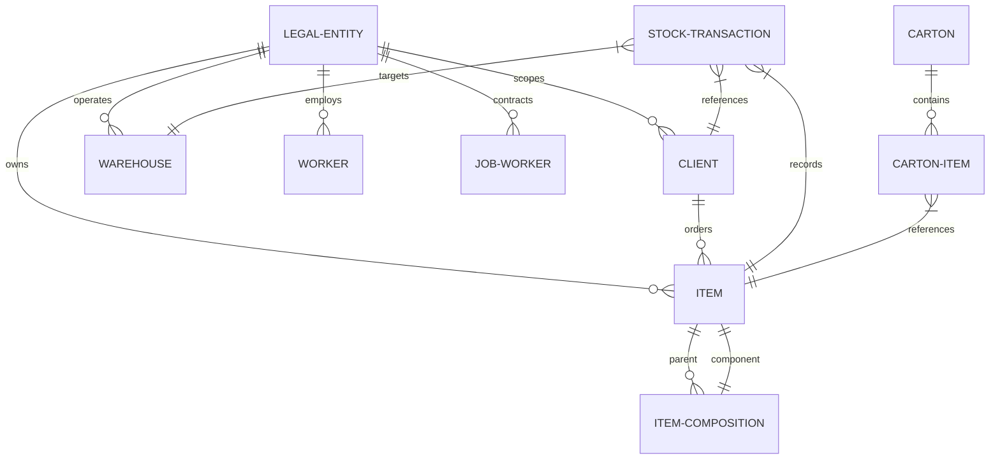

# Business Requirements Document (BRD): Foundry ERP (v3 Normalized Edition)

This document serves as the comprehensive functional, technical, and operational blueprint for **Foundry ERP (v3 Normalized Edition)**. It details all requirements, database normalization schemas, operational pipelines, mobile-responsive layout specifications, worker/labor accounting, and automated bulk import mechanisms.

---

## 1. Executive Summary & Objective

The objective of **Foundry ERP** is to manage and track the full lifecycle of casting, machining, finishing, packaging, and logistics operations within a unified multi-tenant (multi-company) database environment. The system tracks raw brass from melting and casting through progressive processing stages down to packed cartons and final client dispatches, keeping all operational, labor, and financial records stored locally.

### Core Value Drivers
*   **Dynamic Inventory Valuation**: Eliminates hardcoded total columns; stock levels at each stage (Casting, Machining, Polishing, and Ready Goods) are dynamically computed from an immutable, audited transaction ledger.
*   **Normalized Referencing**: Complete Third Normal Form (3NF) relational database preventing record redundancy.
*   **Dual-Company Partitioning**: Safely segregates Master Data (Clients, Items, and Workers) and operational ledgers between Company 1 (Casting Unit) and Company 2 (Finishing & Logistics Unit) under a single database shell.
*   **Piecework & Worker Ledger Integration**: Seamless tracking of standard shifts, hourly/daily wages, and piece-rate workers, including a loan, EMI deduction, and advances tracking system.
*   **Mobile-First Operational Excellence**: A premium mobile interface permitting shop-floor operators to enter heats, machining transfers, and packaging details directly from mobile devices.

---

## 2. Relational Database Schema (3NF Normalization)

The ERP is backed by a fully normalized SQLite schema divided into **Authentication/Workers**, **Master Registries**, and **Operational Ledgers**:



### 2.1 Authentication & Workers Registry (`apps/authentication/models.py`)

#### `CustomUser` (System Accounts)
*   `id` (PK, Integer)
*   `username` (Varchar, Unique)
*   `role` (Varchar, Choices: `ADMIN` (System Admin), `MANAGER` (Production Manager), `OPERATOR` (Casting Operator), `ACCOUNTANT` (Accounts Manager))
*   `company` (FK to `LegalEntity`, Set Null, Nullable) — Determines tenant boundary or global access.

#### `Worker` (In-House Employee Profiles)
*   `id` (PK, Integer)
*   `employee_id` (Varchar, Unique) — Auto-generated (`EMP-1000+id`).
*   `name` (Varchar)
*   `company` (FK to `LegalEntity`, Protect)
*   `salary_model` (Varchar, Choices: `DAILY` (Daily Wage), `FIXED` (Monthly Fixed), `HOURLY` (Hourly/Time Based))
*   `daily_rate` / `monthly_fixed_salary` / `overtime_rate` / `monthly_allowance` / `casting_rate_per_kg` (Floats)
*   `process` (Varchar, Choices: `casting`, `machining`, `polishing`, `packaging`)
*   `phone` / `designation` / `joining_date` / `identity_number` / `emergency_contact_name` / `emergency_contact_phone` / `blood_group` (Metadata)
*   `standard_shift_hours` (Float, Default: 8.0)
*   `active` (Boolean, Default: True)

#### `JobWorker` (External Contractors / Outsource)
*   `id` (PK, Integer)
*   `jw_code` (Varchar, Unique) — Auto-generated (`JW-1000+id`).
*   `name` (Varchar)
*   `company` (FK to `LegalEntity`, Protect)
*   `process` (Varchar, Choices: `casting`, `machining`, `polishing`, `packaging`)
*   `phone` / `address` / `email` / `gst_number` (Metadata)
*   `casting_rate_per_kg` (Float)
*   `active` (Boolean, Default: True)

### 2.2 Master Registries (`apps/master_data/models.py`)

#### `LegalEntity` (Company Profile / Tenant Scope)
*   `id` (PK, Integer)
*   `name` (Varchar, Unique) — E.g., "Company 1: Casting Division", "Company 2: Finishing Division".
*   `gst_number` / `phone` / `letterhead_title` (Varchar, Nullable)
*   `address` (Text)
*   `handles_casting` / `handles_machining` / `handles_polishing` / `handles_packaging` (Boolean workflow routing flags)

#### `Category` (Item Category Registry)
*   `id` (PK, Integer)
*   `name` (Varchar, Unique)

#### `Material` (Material Composition Registry)
*   `id` (PK, Integer)
*   `name` (Varchar, Unique)

#### `Client` (Customers)
*   `id` (PK, Integer)
*   `client_code` (Varchar, Unique) — Auto-generated (`CL-1000+id`).
*   `name` (Varchar)
*   `company` (FK to `LegalEntity`, Protect)
*   `phone` / `email` / `city` / `address` / `gst_number` (Metadata)
*   `active` (Boolean, Default: True)
*   *Constraints*: Unique together on `('name', 'company')`.

#### `Warehouse` (Physical / Process Buffers)
*   `id` (PK, Integer)
*   `code` (Varchar, Unique)
*   `name` (Varchar)
*   `company` (FK to `LegalEntity`, Protect, Nullable)

#### `Item` (Master Stock Catalog & Spec Route Sheets)
*   `id` (PK, Integer)
*   `code` (Varchar, Unique)
*   `name` (Varchar)
*   `category` (Varchar, Choices: `BRASS`, `MORTAR`, `PESTLE`, `CHOPPING_BOARD`, `OTHER`)
*   `sub_category` / `material` / `variant` / `item_type` (Metadata)
*   `company` (FK to `LegalEntity`, Protect, Nullable)
*   `client` (FK to `Client`, Set Null, Nullable)
*   `casting_required` / `machining_required` / `polishing_required` / `packing_required` (Boolean flags)
*   `casting_weight` (Float) — Raw casting weight in kg.
*   `machining_weight` (Float) — Weight post-machining in kg.
*   `lot_size` (Integer, Default: 1) — Minimum carton pack quantity.
*   `lot_with_box` (Integer, Default: 1) — Alternate box carton size.
*   `rate_per_piece` (Float)
*   `active` (Boolean, Default: True)

#### `ItemComposition` (Bill of Materials / BOM Sets)
*   `id` (PK, Integer)
*   `parent_item` (FK to `Item`, Cascade)
*   `component_item` (FK to `Item`, Cascade)
*   `quantity` (PositiveInteger) — Quantity of components per parent.
*   *Constraints*: Unique together on `('parent_item', 'component_item')`.

---

### 2.3 Operational & Labor Ledgers (`apps/production/models.py`)

#### `StockTransaction` (Dynamic Stock Ledger)
*   `id` (PK, Integer)
*   `item` (FK to `Item`, Cascade)
*   `transaction_type` (Varchar, Choices: `casting_entry`, `machining_out`, `machining_in`, `polishing_out`, `polishing_in`, `packaging_in`, `dispatch_out`, `kitting_consume`, `kitting_produce`, `stock_adjustment`)
*   `from_warehouse` / `to_warehouse` (FK to `Warehouse`, Set Null, Nullable)
*   `worker` (FK to `Worker`, Set Null, Nullable)
*   `job_worker` (FK to `JobWorker`, Set Null, Nullable)
*   `client` (FK to `Client`, Set Null, Nullable)
*   `heat_no` (Varchar, Nullable)
*   `quantity` (Integer)
*   `rejection_quantity` (Integer)
*   `weight` (Float)
*   `lot_quantity` (Integer)
*   `notes` (Text)

#### `ItemWorkerAllocation` (Piecework Rates Registry)
*   `id` (PK, Integer)
*   `item` (FK to `Item`, Cascade)
*   `worker` (FK to `Worker`, Cascade, Nullable)
*   `job_worker` (FK to `JobWorker`, Cascade, Nullable)
*   `rate_per_piece` (Float)

#### `Attendance` (Daily Clock-ins)
*   `id` (PK, Integer)
*   `worker` (FK to `Worker`, Cascade)
*   `date` (Date)
*   `status` (Varchar, Choices: `PRESENT`, `ABSENT`, `HALF_DAY`)
*   `overtime_hours` (Float, Default: 0.0)

#### `Loan` (Advances & EMIs)
*   `id` (PK, Integer)
*   `worker` / `job_worker` (FK to Worker/JobWorker, Cascade, Nullable)
*   `total_amount` (Float)
*   `emi_amount` (Float) — Monthly repayment expectation.
*   `remaining_balance` (Float)
*   `issued_date` (Date)
*   `is_active` (Boolean)

#### `LaborPayment` (Compensation Tracking)
*   `id` (PK, Integer)
*   `worker` / `job_worker` (FK to Worker/JobWorker, Set Null, Nullable)
*   `amount` (Float)
*   `date` (Date)
*   `payment_type` (Varchar, Choices: `SALARY`, `ADVANCE`, `NEW_LOAN`, `JOB_WORK`, `LOAN_REPAYMENT`)
*   `payment_mode` (Varchar, Default: "CASH")
*   `reference_no` (Varchar, Nullable)

#### `Carton` (Finished Goods Units)
*   `id` (PK, Integer)
*   `carton_number` (Varchar, Unique) — Auto-generated (`CTN-10000+id`).
*   `carton_type` (Varchar, Choices: `SINGLE` (Single Item), `SET` (Set Item), `MIXED` (Mixed SKU carton))
*   `carton_label` (Varchar, Nullable)
*   `cleaning` / `labeling` / `packing` (Boolean completion checklist)
*   `total_quantity` (Integer)
*   `total_weight` (Float)
*   `status` (Varchar, Choices: `READY` (In Warehouse), `DISPATCHED` (Dispatched))
*   `client` (FK to `Client`, Set Null, Nullable)
*   `dispatched_at` (DateTimeField, Nullable)

#### `CartonItem` (Carton Contents Registry)
*   `id` (PK, Integer)
*   `carton` (FK to `Carton`, Cascade)
*   `item` (FK to `Item`, Cascade)
*   `quantity` (Integer)
*   `weight` (Float)

---

## 3. Operational Workflows & Business Logic

```
   [ Melting & Casting ] 
             │
             ▼ (Casting Weight Registered)
   [ Machining Issue (Out) ] ──► Worker Processing
             │
             ▼ (Machining In: Good Pieces vs Rejections vs Scrap)
   [ Polishing Buffer (Out / In) ] ──► Worker Processing
             │
             ▼ 
   [ Assembly & BOM Kitting ] ──► Dynamic conversion of sub-items to final Sets
             │
             ▼ (Carton Packing: Single, Set, or Mixed SKUs)
   [ Carton Packaging ]
             │
             ▼ (Linked to Clients)
   [ Dispatches ] ──► Dynamic ledger balances reduced to zero
```

### 3.1 Casting Division
*   **Transactions**: Operator submits `Casting Entry` including `Heat No` (e.g., HT-2026-A), item codes, piece counts, and total poured weight.
*   **Casting Stock calculations**: Computes raw cast stock in the warehouse. Raw cast weight balance is dynamically resolved using:
    $$\text{Available Stock} = \sum \text{Casting In} - \sum \text{Machining Out}$$

### 3.2 Machining & Polishing Processing
*   **Process Routing**: Operators issue pieces to workers (`machining_out`), and receive processed pieces back (`machining_in`), capturing processed weights and scrap metal.
*   **WIP Yield Valuation**: Standardizes weight checks to verify yield efficiency:
    $$\text{Yield \%} = \frac{\text{Machined Weight In}}{\text{Casting Weight Out}} \times 100$$
*   **Rejections and Scrap**: Rejections are recorded separately. Worker piecework payouts are only generated for pieces that pass QC (`machining_in` good pieces).

### 3.3 Packaging & Kitting
*   **Cartonization**: Sub-pieces are combined (BOM kitting) or packed individually. The system auto-calculates packed cartons using:
    $$\text{Full Cartons} = \text{Quantity} \div \text{Lot Size}$$
    $$\text{Loose Pieces} = \text{Quantity} \bmod \text{Lot Size}$$
*   **Lot vs Lot with Box Option**: Dynamic packing calculator handles dual packaging profiles based on whether standard boxes or special outer carton quantities apply.
*   **Mixed Cartons**: Supports grouping different SKUs into a single packed `Carton` mapped to a client, which is crucial for custom customer delivery schedules.

### 3.4 Dispatches
*   **Delivery Challans**: Items packed in `Carton` units are marked as `DISPATCHED` and allocated to client transport sheets, dynamically adjusting available ready inventory levels to zero.

---

## 4. Mobile Responsiveness Design System

The visual theme uses a premium, dark-matte Charcoal and Indigo layout configured to adapt natively between monitors and mobile devices.

### Responsive Breakpoints
*   **Desktop View (`>= 992px`)**: Static left sidebar (`width: 260px`) always visible. Content offset cleanly with a static left margin.
*   **Mobile/Tablet View (`< 992px`)**:
    *   **Collapsible Sidebar Drawer**: Left sidebar collapses off-screen (`left: -280px`). Transitions in smoothly using a slide drawer animation (`transition: left 0.3s cubic-bezier(0.4, 0, 0.2, 1)`).
    *   **Sticky Top Brand Header**: Sticky header panel containing logo, title, and a touch-friendly animated hamburger menu button (☰).
    *   **Blurred Overlay Backdrop**: Activating the drawer renders a glassmorphic background layer (`backdrop-filter: blur(8px); background: rgba(0,0,0,0.6)`). Dismissable by tapping the overlay or hitting `Esc`.
    *   **Fluid Typography**: Font sizing resets dynamically from a static `24px` base to a fluid `16px` default for perfect rendering on tight screens.

---

## 5. Bulk Spreadsheet Import Hub

To ensure rapid onboarding of master catalogs, the **Bulk Import Hub** handles visual CSV previews, mapping validations, and transaction commits.

### CSV Layout Specifications

#### Items Sheet Layout (`items_template.csv`)
```csv
code,name,category,casting_weight,machining_weight,casting_required,worker_rates
BR-001,Brass Pestle,PESTLE,1.45,1.30,YES,Ram Singh:12.50; Shyam Lal:10.00
```
*   `worker_rates` *(Advanced Column Mapping)*: Supports mapping multiple operators and piecework allocations within a single cell using semicolon separates: `[Name]:[Rate]; [Name]:[Rate]`.
*   **Yes/No Parser**: Supports intuitive, user-friendly indicators (`Yes`, `No`, `Y`, `N`, `Active`, `1`/`0`) rather than rigid programming codes (`TRUE`/`FALSE`).

### Verification & Validation Engine
1.  **Parsing Phase**: Reads and processes CSV records inside the browser and loads them into a Validation preview grid.
2.  **Row-by-Row Integrity Checks**:
    *   Checks for duplicate keys in code/name fields.
    *   Checks that numeric columns contain valid floats.
    *   Verifies that allocated workers exist in the Employee master registry.
3.  **Atomic Write Commit**: Executes in a single database transaction. If one row fails, the entire transaction rolls back to keep data pristine.

---

## 6. System Maintenance & Safety Features

#### Auto-Backup Schedule
*   Option for `daily`, `weekly`, or `monthly` automated database snapshots with a configurable retention count (e.g., keep the last 10 backups).

#### Auto-Delete Purge
*   Supports scheduled automated purges of historical operational logs (`Every 4 Months`, `Half-Year (6 Months)`, `Every 1 Year`) to maintain database responsiveness on local devices.

#### Safety Audit Block & Logs
*   Auto-logs all backup, restore, reset, and safety blocks inside `MaintenanceLog` to prevent data loss. A backup must pass validation checks before overwriting active SQLite database tables.
