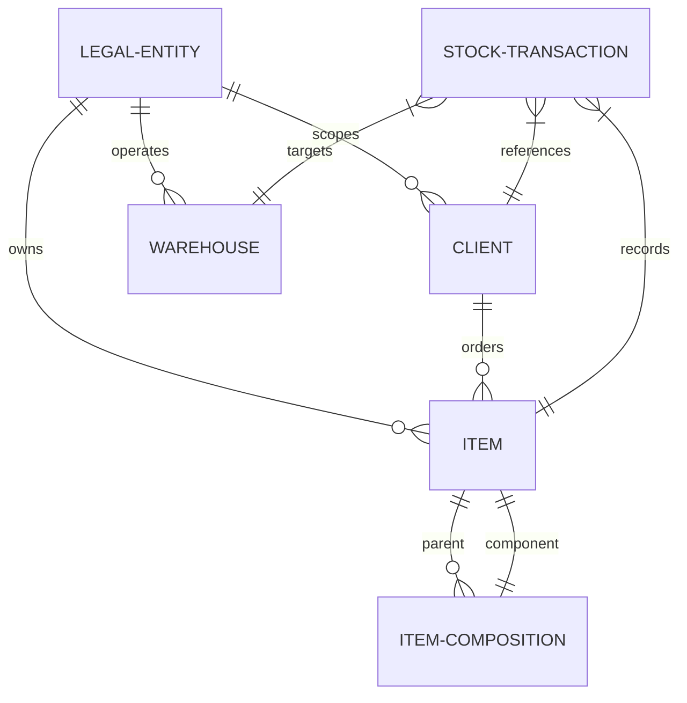

# Business Requirements Document (BRD): Foundry ERP

This document serves as the comprehensive functional, technical, and operational blueprint for **Foundry ERP (v3 Normalized Edition)**. It details all requirements, database normalization schemas, operational pipelines, mobile-responsive layout specifications, and automated bulk import mechanisms.

---

## 1. Executive Summary & Objective

The objective of **Foundry ERP** is to manage and track the full lifecycle of casting, machining, finishing, and logistics operations within a unified multi-tenant (multi-company) database environment. The system tracks raw brass from melting and casting through progressive processing stages down to packed cartons and final client dispatches, keeping all operational and financial records stored locally.

### Core Value Drivers
*   **Dynamic Inventory Valuation**: Eliminates hardcoded total columns; stock levels at each stage (Casting, Machining, Polishing, and Ready Goods) are dynamically computed from an immutable, audited transaction ledger.
*   **Normalized Referencing**: Complete Third Normal Form (3NF) relational database preventing record redundancy.
*   **Dual-Company Partitioning**: Safely segregates Master Data (Clients, Items, and Workers) and operational ledgers between Company 1 (Casting Unit) and Company 2 (Finishing & Logistics Unit) under a single database shell.
*   **Mobile-First Operational Excellence**: A premium, PWA-ready mobile interface permitting shop-floor operators to enter heats, issues, and packaging details directly from mobile devices.

---

## 2. Relational Database Schema (3NF Normalization)

The ERP is backed by a fully normalized SQLite schema divided into **Master Registries** and **Operational Ledgers**:



### 2.1 Master Registries (`apps/master_data/models.py`)

#### `LegalEntity` (Company Profile)
*   `id` (PK, Integer)
*   `name` (Varchar, Unique) — E.g., "Company 1: Casting Division", "Company 2: Finishing Division".
*   `gst_number` (Varchar, Nullable)
*   `phone` (Varchar, Nullable)
*   `address` (Text)

#### `Client` (Customers)
*   `id` (PK, Integer)
*   `name` (Varchar)
*   `company` (FK to `LegalEntity`, Protect)
*   `gst_number` (Varchar, Nullable)
*   `phone` (Varchar, Nullable)
*   `email` (Varchar, Nullable)
*   `city` (Varchar, Nullable)
*   `address` (Text, Nullable)
*   `active` (Boolean, Default: True)
*   *Constraints*: Unique together on `('name', 'company')`.

#### `Item` (Master Stock Catalog)
*   `id` (PK, Integer)
*   `code` (Varchar, Unique)
*   `name` (Varchar)
*   `category` (Varchar, Choices: Brass, Mortar, Pestle, Chopping Board, Other)
*   `company` (FK to `LegalEntity`, Protect, Nullable)
*   `client` (FK to `Client`, Set Null, Nullable)
*   `casting_weight` (Float, Default: 0.0)
*   `machining_weight` (Float, Default: 0.0)
*   `casting_required` / `machining_required` / `polishing_required` / `packing_required` (Boolean flags)
*   `lot_size` (Integer, Default: 1) — Multi-pack carton sizes.
*   `rate_per_piece` (Float, Default: 0.0)

#### `ItemComposition` (Bill of Materials / BOM Sets)
*   `id` (PK, Integer)
*   `parent_item` (FK to `Item`, Cascade)
*   `component_item` (FK to `Item`, Cascade)
*   `quantity` (Integer)
*   *Constraints*: Unique together on `('parent_item', 'component_item')`.

### 2.2 Operational & Labor Ledgers (`apps/production/models.py`)

#### `StockTransaction` (Dynamic Stock Ledger)
*   `id` (PK, Integer)
*   `item` (FK to `Item`, Cascade)
*   `transaction_type` (Varchar, Choices: `casting_entry`, `machining_out`, `machining_in`, `polishing_out`, `polishing_in`, `packaging_in`, `dispatch_out`, `kitting_consume`, `kitting_produce`)
*   `from_warehouse` / `to_warehouse` (FK to `Warehouse`, Set Null, Nullable)
*   `worker` / `job_worker` (FK to Worker profiles, Set Null, Nullable)
*   `client` (FK to `Client`, Set Null, Nullable)
*   `heat_no` (Varchar, Nullable)
*   `quantity` (Integer)
*   `rejection_quantity` (Integer)
*   `weight` (Float)

#### `ItemWorkerAllocation` (Piecework Rates Registry)
*   `id` (PK, Integer)
*   `item` (FK to `Item`, Cascade)
*   `worker` (FK to Worker, Cascade, Nullable)
*   `job_worker` (FK to JobWorker, Cascade, Nullable)
*   `rate_per_piece` (Float)

#### `Attendance` (Daily Clock-ins)
*   `id` (PK, Integer)
*   `worker` (FK to Worker, Cascade)
*   `date` (Date)
*   `status` (Varchar, Choices: Present, Absent, Half Day)
*   `overtime_hours` (Float, Default: 0.0)

#### `Loan` (Advances & EMIs)
*   `id` (PK, Integer)
*   `worker` / `job_worker` (FK, Cascade, Nullable)
*   `total_amount` (Float)
*   `emi_amount` (Float)
*   `remaining_balance` (Float)

---

## 3. Operational Workflows & Business Logic

```
[ Melting & Casting ] 
       │ (Weight Rec)
       ▼
[ Machining Issue & Receive ] ──► (Scrap Recycled)
       │
       ▼
[ Polishing Buffer ]
       │
       ▼
[ Assembly & Packaging ] ──► (Master Cartons)
       │
       ▼
[ Dispatch & Shipping ] ──► (Challan & Invoice)
```

### 3.1 Casting Division
*   **Transactions**: Operator submits `Casting Entry` including `Heat No` (e.g., HT-2026-A), item codes, piece counts, and total poured weight.
*   **Casting Stock calculations**: Computes raw cast stock in the warehouse. Raw cast weight balance is dynamically resolved using:
    $$\text{Available Stock} = \sum \text{Casting In} - \sum \text{Machining Out}$$

### 3.2 Machining & Polishing Processing
*   **Process Routing**: Operators issue pieces to workers (`machining_out`), and receive processed pieces back (`machining_in`), capturing processed weights and scrap metal.
*   **WIP Valuation**: Standardizes weight checks to verify yield efficiency:
    $$\text{Yield \%} = \frac{\text{Machined Weight In}}{\text{Casting Weight Out}} \times 100$$

### 3.3 Packaging & Kitting
*   **Cartonization**: Sub-pieces are combined (BOM kitting) or packed individually. The system auto-calculates packed cartons:
    $$\text{Full Cartons} = \text{Quantity} \div \text{Lot Size}$$
    $$\text{Loose Pieces} = \text{Quantity} \bmod \text{Lot Size}$$
*   **Mixed Cartons**: Supports grouping different SKUs into a single packed `Carton` mapped to a client.

### 3.4 Dispatches
*   **Delivery Challans**: Items packed in `Carton` units are marked as `DISPATCHED` and allocated to client transport sheets, dynamically adjusting available ready inventory levels to zero.

---

## 4. Mobile Responsiveness Design System

The visual theme uses a premium, dark-matte Charcoal and Indigo layout configured to adapt natively between monitors and mobile devices.

### Responsive Breakpoints
*   **Desktop View (`>= 992px`)**: Static left sidebar (`width: 260px`) always visible. Content offset cleanly with a static left margin.
*   **Mobile/Tablet View (`< 992px`)**:
    *   **Collapsible Sidebar Drawer**: Left sidebar collapses off-screen (`left: -280px`). Transitions in smoothly using a slide drawer animation (`transition: left 0.3s cubic-bezier(0.4, 0, 0.2, 1)`).
    *   **Sticky Top Brand Header**: Sticky header panel containing logo, title, and a touch-friendly animated hamburger menu button (☰).
    *   **Blurred Overlay Backdrop**: Activating the drawer renders a glassmorphic background layer (`backdrop-filter: blur(8px); background: rgba(0,0,0,0.6)`). Dismissable by tapping the overlay or hitting `Esc`.
    *   **Fluid Typography**: Font sizing resets dynamically from a static `24px` base to a fluid `16px` default for perfect rendering on tight screens.

---

## 5. Bulk Spreadsheet Import Hub

To ensure rapid onboarding of master catalogs, the **Bulk Import Hub** handles visual CSV previews, mapping validations, and transaction commits.

### CSV Layout Specifications

#### Items Sheet Layout (`items_template.csv`)
```csv
code,name,category,casting_weight,machining_weight,casting_required,worker_rates
BR-001,Brass Pestle,PESTLE,1.45,1.30,YES,Ram Singh:12.50; Shyam Lal:10.00
```
*   `worker_rates` *(Advanced Column Mapping)*: Supports mapping multiple operators and piecework allocations within a single cell using semicolon separates: `[Name]:[Rate]; [Name]:[Rate]`.
*   **Yes/No Parser**: Supports intuitive, user-friendly indicators (`Yes`, `No`, `Y`, `N`, `Active`, `1`/`0`) rather than rigid programming codes (`TRUE`/`FALSE`).

### Verification & Validation Engine
1.  **Parsing Phase**: Reads and processes CSV records inside the browser and loads them into a Validation preview grid.
2.  **Row-by-Row Integrity Checks**:
    *   Checks for duplicate keys in code/name fields.
    *   Checks that numeric columns contain valid floats.
    *   Verifies that allocated workers exist in the Employee master registry.
3.  **Atomic Write Commit**: Executes in a single database transaction. If one row fails, the entire transaction rolls back to keep data pristine.
