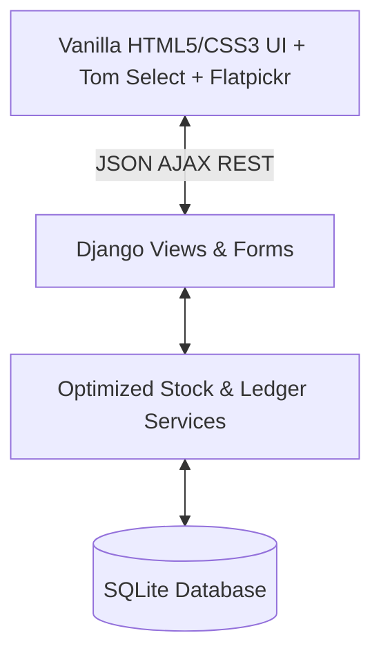
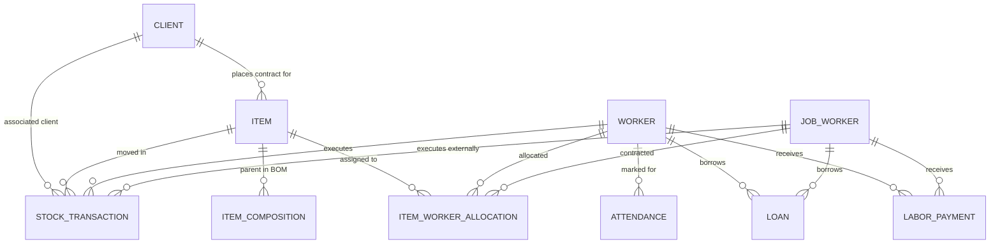

# Foundry ERP — Business Requirements Document (BRD)

---

## Document Control & Metadata

| Field | Detail |
| :--- | :--- |
| **Project Name** | Foundry ERP — Metal Casting & Dispatch Suite |
| **Document Version** | 2.0 (Comprehensive Specification) |
| **Last Updated** | 2026-05-17 |
| **Authors** | Lead ERP Architect (User) & Antigravity (AI Coding Assistant) |
| **Target Audience** | Engineering Team, System Operators, Quality Control Leads, Finance & HR Managers |

---

## 1. Project Overview & Business Context

**Foundry ERP** is a robust, custom-built enterprise resource planning application tailored specifically for the metal foundry manufacturing domain (e.g., Brass, Stainless Steel, Cast Iron, and Aluminium product lines). The software controls and monitors the end-to-end operational lifecycle, tracing every gram of metal from the high-temperature melting furnace to quality control, labor-intensive machining/polishing, structural assembly kitting, and finally packaging and dispatch logistics.

### Core Business Pain Points Solved
1. **Loss of Traceability**: Links furnace outputs (Heat Numbers) directly to client contracts and stage-wise transactions.
2. **Inventory Discrepancy**: Standardizes stock tracking into pieces, weights (casting weight vs. machining weight), and packaging carton metrics.
3. **Labor & Vendor Governance**: Unifies in-house employees (attendance-based shift wages) and external job workers (performance-based piece rates) in a bifurcated ledger database.
4. **Financial Overhead Control**: Automates loans, standard EMI repayments, daily allowances, overtime, and monthly labor settlement calculation engines.

---

## 2. Technical Architecture & System Design

The application is engineered using high-performance, lightweight web technologies optimized for local deployment and low-resource edge servers.



### 2.1 Technology Stack
*   **Backend Framework**: Django (Python 3) web framework with a service-oriented architectural layer to offload complex query aggregations.
*   **Database**: SQLite (`core/db.sqlite3`) with timezones synced to `'Asia/Kolkata'`.
*   **Frontend Design System**: Vanilla CSS built upon modern dark-mode aesthetic custom variables, standardizing:
    *   **Backgrounds**: Very dark matte blue-black (`#0b0f19`) and charcoal cards (`#111827`).
    *   **Accents**: Matte indigo (`#4f46e5`) and amber gold (`#b45309`).
    *   **Typography**: Inter (Google Fonts) with system fallbacks.
*   **Interactive Components**: 
    *   **Tom Select**: Used for instant, high-fidelity searchable selection dropdowns.
    *   **Flatpickr**: Powers responsive date selection, calendar range-bounding, and ledger date filters.

### 2.2 Key Workspace Directory Structure
```text
/Users/kizzzz/erp_project/
├── core/
│   ├── core/
│   │   ├── settings.py          # Database and localization configuration
│   │   ├── urls.py              # Global URL router
│   ├── inventory/
│   │   ├── models.py            # Custom DB schemas and auto-generation hooks
│   │   ├── views.py             # Route controller handlers (CRUD logic)
│   │   ├── services.py          # Optimized database query service aggregates
│   │   ├── forms.py             # Form validations (Item, Client, Worker forms)
│   │   ├── urls.py              # Application route register
│   │   ├── utils.py             # Shared utility functions
│   ├── templates/
│   │   ├── layout/
│   │   │   └── base.html        # Global theme template (matte dark-mode styles)
│   │   ├── dashboard.html       # Visual overview of stock metrics and daily counts
│   │   ├── casting.html         # Furnace entry controls and daily analytics
│   │   ├── machining.html       # Inward/Outward WIP worker tracking
│   │   ├── polishing.html       # Complex set processing and marks
│   │   ├── packaging.html       # Quality control and packaging tracking
│   │   ├── dispatch.html        # Client shipping & carton logistics
│   │   ├── labor_ledger.html    # HR payroll, loans, and attendance panels
│   │   └── master_data.html     # Tabs for dynamic CRUD of Items, Clients, Workers
```

---

## 3. Data Model & Database Schema

The database model implements strict data relationships to preserve historical logs even if master data is updated.



### 3.1 Item Master (`Item`)
Represents an item manufactured in the foundry. Supports nested compositions (BOMs).
*   `client` (FK to `Client`, nullable, `SET_NULL`): Links item with a specific client.
*   `code` (CharField, unique): Unique system code (e.g. `ITM-101`).
*   `name` (CharField): Descriptive item name.
*   `category` (CharField, Choices): Standard product category (`BRASS`, `MORTAR`, `PESTLE`, `CHOPPING` (Chopping Board), `OTHER`).
*   `sub_category` (CharField, optional)
*   `material` (CharField, optional, Choices): Raw metallurgy (`BRASS`, `SS` (Stainless Steel), `CI` (Cast Iron), `ALUMINIUM`).
*   `variant` (CharField, optional)
*   `item_type` (CharField, default `'REGULAR'`): Identifies composition (e.g., `'REGULAR'` vs `'SET'`).
*   `casting_weight` (FloatField, default `0`): Target raw weight in kg per unit.
*   `machining_weight` (FloatField, default `0`): Target finished weight in kg per unit post-machining.
*   `lot_size` (IntegerField, default `0`)
*   `lot_with_box` (IntegerField, default `0`): Carton size multiplier (e.g. 50 pieces per carton) for dispatch weight mapping.
*   `process` (CharField, Choices): Default process type (`casting`, `machining`, `polishing`, `packaging`).
*   `casting_required` / `machining_required` / `polishing_required` / `packing_required` (BooleanFields, default `True`): Process routing checklist flag gates.
*   `rate_per_piece` (FloatField, default `0`)
*   `notes` (TextField, optional)
*   `active` (BooleanField, default `True`)

### 3.2 Client Master (`Client`)
Represents customers buying final products.
*   `name` (CharField): Company or client name.
*   `phone` / `email` / `city` / `address` (optional text/char fields)
*   `gst_number` (CharField, max 15, optional): Tax compliance identifier.
*   `active` (BooleanField, default `True`)

### 3.3 Worker Master (`Worker` - Internal Employees)
Represents in-house company employees subject to shift parameters, attendance, and fixed or hourly finance rules.
*   `employee_id` (CharField, unique, auto-generated): Automatically created as `EMP-1000 + ID` on insertion.
*   `name` (CharField): Legal name of employee.
*   `salary_model` (CharField, Choices): Monthly payment rule (`DAILY` (Daily Wage), `FIXED` (Monthly Fixed), `HOURLY` (Hourly/Time Based)).
*   `daily_rate` (FloatField, default `0`): Daily base pay rate.
*   `monthly_fixed_salary` (FloatField, default `0`): Base pay for monthly contract.
*   `overtime_rate` (FloatField, default `0`): Auto-calculated upon creation as `daily_rate / standard_shift_hours` if standard shift is active and overtime is undefined.
*   `monthly_allowance` (FloatField, default `0`): Automatic monthly financial allowance added to salary base.
*   `process` (CharField, Choices): Primary department allocation (defaults to `machining`).
*   `phone` / `blood_group` / `joining_date` / `designation` (optional)
*   `standard_shift_hours` (FloatField, default `8`): Baseline shift length.
*   `identity_number` (CharField, optional): Govt Aadhar number.
*   `emergency_contact_name` / `emergency_contact_phone` (CharField, optional)
*   `active` (BooleanField, default `True`)

### 3.4 Job Worker Master (`JobWorker` - External Vendors)
Represents external commercial vendors and workshops doing contract job work.
*   `jw_code` (CharField, unique, auto-generated): Automatically created as `JW-1000 + ID` on insertion.
*   `name` (CharField): Vendor or workshop name.
*   `process` (CharField, Choices): Primary outsourced process (e.g. `machining`, `polishing`).
*   `phone` / `address` / `email` (optional)
*   `gst_number` (CharField, max 15, optional)
*   `active` (BooleanField, default `True`)

### 3.5 Logical Warehouses (`Warehouse`)
Tracks localized inventories.
*   `name` (CharField): e.g. `Casting Stock`, `Machining Stock`.
*   `code` (CharField, unique): Logical system identifier (`CASTING`, `MACHINING`, `POLISHING`, `READY`).

### 3.6 Item-Worker Rate Allocations (`ItemWorkerAllocation`)
Standardizes piece-rate payouts for specific items processed by specific workers.
*   `item` (FK to `Item`, cascade)
*   `worker` (FK to `Worker`, optional, cascade): Links to internal employee (for custom piece-rate bonus).
*   `job_worker` (FK to `JobWorker`, optional, cascade): Links to external contractor.
*   `rate_per_piece` (FloatField, default `0`): Financial pay per processed unit.

### 3.7 Stock Transactions Engine (`StockTransaction`)
The engine recording every inventory mutation.
*   `item` (FK to `Item`, cascade)
*   `transaction_type` (CharField, Choices): System transactions (`casting_entry`, `machining_out`, `machining_in`, `polishing_out`, `polishing_in`, `packaging_in`, `dispatch_out`, `kitting_consume`, `kitting_produce`).
*   `from_warehouse` (FK to `Warehouse`, nullable, `SET_NULL`)
*   `to_warehouse` (FK to `Warehouse`, nullable, `SET_NULL`)
*   `worker` (FK to `Worker`, nullable, `SET_NULL`): Assigns processing responsibility to an employee.
*   `job_worker` (FK to `JobWorker`, nullable, `SET_NULL`): Assigns outsourcing responsibility to a vendor.
*   `client` (FK to `Client`, nullable, `SET_NULL`)
*   `heat_no` (CharField, optional): Furnace heat number.
*   `quantity` (IntegerField, default `0`): Count of pieces moved.
*   `rejection_quantity` (IntegerField, default `0`): QC rejected pieces tracking (used in `machining_in` to isolate yield losses).
*   `weight` (FloatField, default `0`): Actual weight in kg of pieces.
*   `lot_quantity` (IntegerField, default `0`)
*   `notes` (TextField, optional): Carries auto-audit trails (e.g. `"Auto-consumed for Set Transaction #15"`).
*   `created_at` (DateTimeField, auto_now_add)

### 3.8 BOM Compositions (`ItemComposition`)
*   `parent_item` (FK to `Item`, cascade, related name `components`): The final composite/parent set.
*   `component_item` (FK to `Item`, cascade, related name `parent_sets`): Individual loose piece component.
*   `quantity` (PositiveIntegerField, default `1`): Count of units required to form one parent set.

### 3.9 Attendance Tracking (`Attendance`)
*   `worker` (FK to `Worker`, cascade)
*   `date` (DateField, default `timezone.now`)
*   `status` (CharField, Choices): (`PRESENT`, `ABSENT`, `HALF_DAY`).
*   `overtime_hours` (FloatField, default `0`): Direct overtime clocking.
*   `notes` (TextField, optional)

### 3.10 Worker Financial Credit & Advances (`Loan`)
Tracks loans issued to staff with automated EMI repayment calculations.
*   `worker` / `job_worker` (FK to `Worker`/`JobWorker`, nullable, cascade)
*   `total_amount` (FloatField): Principle loan issued.
*   `emi_amount` (FloatField): Standard deduction amount subtracted during monthly settlement.
*   `remaining_balance` (FloatField): Outstanding credit balance.
*   `issued_date` (DateField)
*   `is_active` (BooleanField, default `True`)
*   `description` (TextField, optional)

### 3.11 Payments Ledger (`LaborPayment`)
Detailed audit trail of cash outflow.
*   `worker` / `job_worker` (FK to `Worker`/`JobWorker`, nullable, `SET_NULL`)
*   `amount` (FloatField): Value of the cash flow.
*   `date` (DateField)
*   `payment_type` (CharField, Choices): (`SALARY`, `ADVANCE`, `NEW_LOAN`, `JOB_WORK` (Vendor payment), `LOAN_REPAYMENT`).
*   `payment_mode` (CharField, default `"CASH"`): Cash, Bank Transfer, UPI, Cheque.
*   `reference_no` (CharField, optional)
*   `notes` (TextField, optional)

---

## 4. End-to-End System Workflows & Business Logic

### 4.1 The Stage-Wise Production & Stock Lifecycle

Production progresses sequentially across gated staging areas. The stock equations are governed in `core/inventory/services.py` to achieve transactional integrity.

```text
  [ Furnace Furnace ]
          │
          ▼
   ( casting_entry )   ===> Moves stock into [CASTING WAREHOUSE]
          │
   ( machining_out )   ===> Moves stock out of [CASTING] into Worker WIP
          │
   ( machining_in )    ===> Moves finished pieces to [MACHINING WAREHOUSE]
          │                 (QC rejects are recorded and removed here)
          │
   ( polishing_out )   ===> Moves stock out of [MACHINING] into Polisher WIP
          │                 (Optional Set Assembly consume triggered here)
          │
   ( polishing_in )    ===> Marks processing complete
          │
   ( packaging_in )    ===> Consumes polished stock, moves to [READY WAREHOUSE]
          │                 (Alternative Parent Set Produce happens here)
          │
   ( dispatch_out )    ===> Consumes [READY] stock for shipping to Client
```

#### Step 1: Casting Stock Entry
*   **Operational Trigger**: Furnace operators log the day's heats.
*   **Business Logic**: Operators inputs a `heat_no`, chooses the target `Client`, and registers multiple rows containing the manufactured `Item`, `quantity`, and actual measured `weight`.
*   **Automation**: UI auto-calculates estimated weight from the item's baseline `casting_weight` * `quantity` entered, allowing manual overrides for variations.
*   **Stock Effect**: Generates a `casting_entry` transaction increasing `CASTING` warehouse inventory.

#### Step 2: Machining Operations (With Worker Allocation)
*   **Operational Trigger**: Issuing casting pieces to machine shop workers.
*   **Direction "Out" (Issue)**: Pieces move from `CASTING` to the selected worker's Work-in-Progress (WIP).
*   **Direction "In" (Receive)**: Worker returns machined pieces.
    *   *Yield & Defect Tracking*: Inward transactions must declare both `quantity` (accepted yield) and `rejection_quantity` (defective or cracked pieces).
    *   *Stock Effect*:
        $$\text{Casting Warehouse Qty} = \text{casting\_entry} - \text{machining\_out}$$
        $$\text{Machining Warehouse Qty} = \text{machining\_in} - \text{polishing\_out} - \text{kitting\_consume\_machining}$$
    *   *Pending WIP balance calculation*:
        $$\text{Worker Pending WIP} = \text{machining\_out} - \text{machining\_in} - \text{rejection\_quantity}$$

#### Step 3: Polishing Operations & Assembly (Kitting)
*   **Operational Trigger**: Polishing raw machined pieces or assembling complex "Sets" (e.g., Mortar & Pestle set).
*   **The Assembly (Kitting) Engine**:
    *   When a composite parent `Item` (marked as a `SET` composition) is processed, the system automatically checks its `ItemComposition` ratios.
    *   *Auto-Consumption*: When parent sets are produced (`KITTING_PRODUCE` or polishing transactions), the sub-components are automatically consumed (`KITTING_CONSUME`) from the `MACHINING` or `POLISHING` stock to keep physical warehouse balances 100% synchronized.
*   **Polishing Inward/Outward Gate**:
    *   `polishing_out`: Stock goes to polishing worker WIP.
    *   `polishing_in`: Marks work completed, shifting inventory balances to the Packaging staging line.

#### Step 4: Packaging and Ready Stock
*   **Operational Trigger**: Products undergo final cleaning and box packing.
*   **Stock Effect**: Generates a `packaging_in` transaction which deducts from `POLISHING` stock and adds to the `READY` warehouse.

#### Step 5: Order Dispatch & Sales Fulfillments
*   **Operational Trigger**: Loading trucks for transport to customers.
*   **Business Logic**: Matches stock levels in `READY` warehouse. Consumes inventory through a `dispatch_out` transaction.
*   **Box & Carton Arithmetic**: Enables dispatch management in both "Loose Pieces" and "Full Cartons" using the `lot_with_box` packaging multiplier defined in the Item Master.

---

### 4.2 HR Attendance & Labor Finance Lifecycle

This workflow governs payroll bookkeeping, ensuring workers are fairly compensated and company advances are legally tracked and recouped.

```text
   Daily Attendance logs (OT hours, Shift statuses)
                     │
                     ▼
  Piece-Rate records (Machining / Polishing receipts)
                     │
                     ▼
   Automatic Monthly Settlement calculations:
     + Base Wage (Shift count or fixed rate)
     + Piece-Rate bonuses (Allocated Item-Worker rates)
     + Overtime payout (OT hours * OT rate)
     + Monthly allowances
     - Loan EMI standard deductions
     - Mid-month Cash Advances
                     │
                     ▼
            [ Settle Payment ]
```

#### 1. Daily Attendance Tracker
*   Marked daily for internal employees.
*   Options: `PRESENT` (Full day wage), `ABSENT` (Zero wage), `HALF_DAY` (50% day wage).
*   **Overtime**: Overtime hours are tracked. The financial formula for overtime payout is:
    $$\text{OT Payout} = \text{overtime\_hours} \times \text{Worker.overtime\_rate}$$
    *(Note: Worker.overtime_rate is automatically initialized to $\text{daily\_rate} / \text{standard\_shift\_hours}$ if standard shifts are configured and not overridden).*

#### 2. Item Worker Piece-Rates Allocation
*   Allows the company to assign custom pay rates for difficult operations.
*   For example: Polishing a heavy mortar variant might pay ₹12.00 per piece, whereas machining a simple brass ring variant might pay ₹1.50 per piece.
*   Linked dynamically during production receipt transactions (`machining_in` or `polishing_in`) to automatically calculate piece-rate earnings.

#### 3. Loan EMI Repayments
*   Workers can request mid-month loans.
*   On approval, a `Loan` is registered, increasing outstanding `remaining_balance`.
*   During monthly payroll generation:
    *   The system checks active loans.
    *   Applies a standard `emi_amount` deduction, subtracting it from the net monthly dues.
    *   Lowers the loan's `remaining_balance` and records a transaction of type `LOAN_REPAYMENT`.

#### 4. Payroll Settlement Engine
At the close of a calendar month, managers run the **Labor Monthly Settlement Ledger**. The engine aggregates:
*   **Earnings**:
    *   *Daily Wage Workers*: $\text{Days Present} \times \text{daily\_rate}$ (Half-day acts as 0.5 days).
    *   *Fixed Workers*: $\text{Monthly Fixed Salary}$ (Adjusted proportionally for absenteeism).
    *   *Hourly Workers*: $\text{Standard Hours worked} \times \text{hourly\_rate}$.
    *   *Overtime*: Total OT hours * overtime_rate.
    *   *Piece-rate Bonus*: Aggregated piece rates from all inward transactions.
    *   *Allowances*: Dynamic monthly allowances.
*   **Deductions**:
    *   *Loan EMI*: Monthly loan installments.
    *   *Advances*: Outflow payments already collected by the worker as cash advances during the active month.
*   **Net Payout**:
    $$\text{Net Payout} = \text{Total Earnings} - \text{Total Deductions}$$

---

## 5. Web UI Design & API Integration Interfaces

The user interface uses visual elements to help operators manage fast data entry on the warehouse floor.

### 5.1 Dynamic AJAX REST Endpoints
*   **`GET /api/item/<item_id>/workers/`**: Returns a list of all workers allocated to the given item along with their customized piece-rate values. Used to auto-fill worker options in machining/polishing templates.
*   **`GET /api/worker/<worker_id>/items/`**: Reverse search. Retrieves all items assigned to a specific worker.
*   **`GET /api/item/<item_id>/composition/`**: Retrieves the sub-components and composition multipliers for parent sets. Used to show composition warnings before stock consumption in Assembly workflows.
*   **`GET /api/worker/<worker_id>/profile/`** / **`GET /api/job-worker/<jw_id>/profile/`**: Fetches Aadhar compliance, joining dates, base pay, and active loan balances.
*   **`POST /api/attendance/mark/`**: Registers the daily attendance status and OT hours for selected workers.
*   **`POST /api/payment/record/`**: Records advances, salary payouts, and loan settlements in the transaction ledger.

### 5.2 UI/UX Aesthetics and Interactivity
1. **Searchable Select Selectors**: Powered by Tom Select to handle thousands of items, clients, and workers smoothly without lag.
2. **Dynamic Sliders & Toggles**: Inward and outward directions are styled as color-coded, animated toggle buttons (e.g., Green for Inward, Purple/Blue for Outward).
3. **Date Pickers**: Calendar controls powered by Flatpickr, locked into clean dark-mode themes.
4. **Day Summaries & Analytics Banners**: Displays total pieces, active heat counts, and total weights processed today.

---

## 6. Key Implementation Notes & Guidelines

### 6.1 Database Isolation & Performance
*   **Avoid N+1 Queries**: The StockTransaction engine must use Django `select_related("item", "client", "worker", "job_worker")` to avoid severe database overhead on large lists.
*   **Optimized Stock Aggregation**: To prevent scaling bottlenecks, `inventory/services.py` calculates warehouse volumes using single-pass database aggregates (`Sum`) grouped by `transaction_type` and `from_warehouse__code`, rather than looping through individual transaction records in Python memory.

### 6.2 Operational Edge Cases & Rules
*   **WIP Yield Losses**: If machining issues 100 units to a worker, and 95 are returned good while 3 are returned cracked/broken, the worker registers:
    *   Quantity = 95
    *   Rejection Quantity = 3
    *   Pending Worker balance is reduced to: $100 - (95 + 3) = 2$ units.
    *   *Stock Effect*: Only 95 pieces enter the `MACHINING` warehouse. The 3 rejected pieces are permanently logged as material yield loss and removed from the active stock.
*   **Automatic Warehouse Bootstrapping**: Views and scripts must call `create_default_warehouses()` to guarantee that standard warehouses (`CASTING`, `MACHINING`, `POLISHING`, `READY`) exist before any transactions are committed.

---

*Document Reference End*  
**Foundry ERP BRD v2.0**
